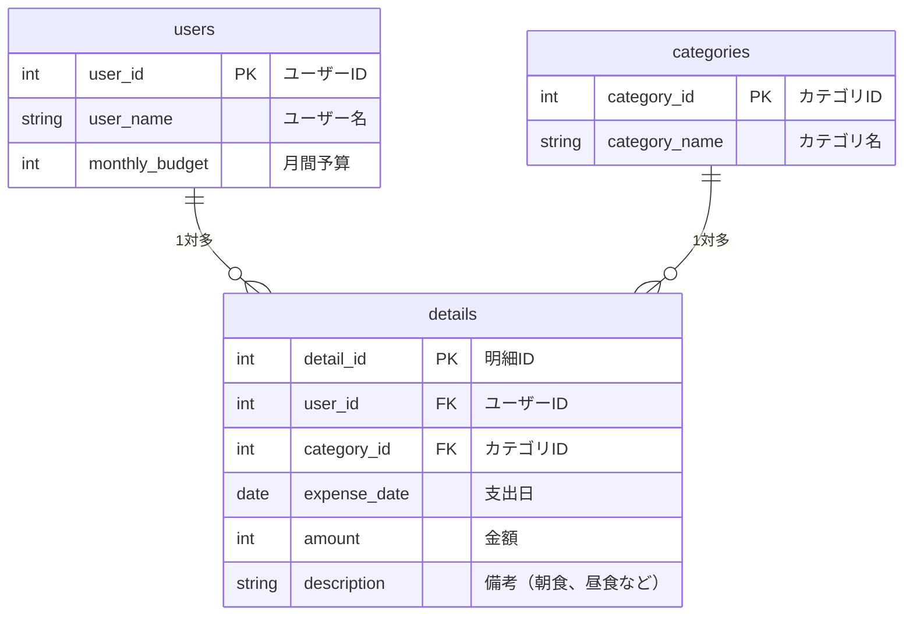

# react-hono-app-template

フロントエンドが **React + TypeScript + Tailwind CSS**、バックエンドが **Hono + TypeScript**、DB が **MySQL 8.0** の Todo リストアプリのテンプレートです。

ローカルでは Docker Compose で動かし、AWS CDK を使って ECS Fargate + RDS にデプロイできます。

---

## 技術スタック

| 領域 | 技術 |
|------|------|
| フロントエンド | React 18, TypeScript, Vite, Tailwind CSS |
| バックエンド | Hono, @hono/node-server, TypeScript |
| データベース | MySQL 8.0 |
| テスト | Vitest, React Testing Library |
| ローカル環境 | Docker Compose |
| AWS インフラ | ECS Fargate, RDS, ALB, ECR, Secrets Manager（AWS CDK で構成） |

---

## 事前準備

以下のツールをあらかじめインストールしてください。

- [Docker Desktop](https://www.docker.com/products/docker-desktop/)
- [Node.js 20+](https://nodejs.org/)
- [AWS CLI](https://aws.amazon.com/cli/)（AWS デプロイ時のみ）

---

## 手順 1: テンプレートから自前のリポジトリを作成する

1. このリポジトリのページ右上にある **「Use this template」** ボタンをクリックする
2. リポジトリ名を入力して **「Create repository」** をクリックする
3. 自分のアカウントに新しいリポジトリが作成される

---

## 手順 2: ローカルにリポジトリを clone する

```bash
# <your-username> と <your-repo-name> を自分のものに書き換えてください
git clone https://github.com/<your-username>/<your-repo-name>.git
cd <your-repo-name>
```

環境変数ファイルをコピーします。

```bash
cp .env.example .env
```

> `.env` ファイルは Git に含まれません。必要に応じて値を変更してください。

---

## 手順 3: ローカルでアプリを動かす

### 起動

```bash
docker compose up --build
```

初回はイメージのダウンロードとビルドに数分かかります。

### アクセス

| サービス | URL |
|---------|-----|
| フロントエンド | http://localhost:5173 |
| バックエンド API | http://localhost:3000/api/todos |

### API の確認（curl サンプル）

```bash
# Todo 一覧を取得する
curl http://localhost:3000/api/todos

# Todo を作成する
curl -X POST http://localhost:3000/api/todos \
  -H "Content-Type: application/json" \
  -d '{"title": "はじめての Todo"}'

# Todo を更新する（id=1 の Todo のタイトルと完了状態を変更する）
curl -X PUT http://localhost:3000/api/todos/1 \
  -H "Content-Type: application/json" \
  -d '{"title": "更新後のタイトル", "completed": true}'
```

### テストを実行する

```bash
# バックエンド
cd backend && npm install && npm test

# フロントエンド
cd frontend && npm install && npm test
```

### 停止

```bash
docker compose down
```

> データを完全に削除したい場合は `docker compose down -v` を実行してください。

---

## 手順 4: AWS にデプロイする

> AWS アカウントと、必要な権限を持つ IAM ユーザーが必要です。

### 4-1. AWS CLI の設定

```bash
aws configure
# AWS Access Key ID, Secret Access Key, Region (ap-northeast-1), Output format (json) を入力する
```

### 4-2. CDK の依存関係をインストールする

```bash
cd cdk
npm install
```

### 4-3. CDK Bootstrap（初回のみ）

CDK をはじめて使うアカウント・リージョンでは、事前に Bootstrap が必要です。

```bash
# <your-aws-account-id> を自分の AWS アカウント ID に書き換えてください
export AWS_ACCOUNT_ID=<your-aws-account-id>
npx cdk bootstrap aws://${AWS_ACCOUNT_ID}/ap-northeast-1
```

### 4-4. VPC・ECR・RDS スタックをデプロイする

```bash
npx cdk deploy VpcStack EcrStack DatabaseStack
```

デプロイ完了後、出力された ECR リポジトリ URI をメモしておきます。

```
EcrStack.FrontendRepositoryUri = <account-id>.dkr.ecr.ap-northeast-1.amazonaws.com/todo-app-frontend
EcrStack.BackendRepositoryUri  = <account-id>.dkr.ecr.ap-northeast-1.amazonaws.com/todo-app-backend
```

### 4-5. Docker イメージをビルドして ECR に Push する

```bash
# ECR にログインする
aws ecr get-login-password --region ap-northeast-1 \
  | docker login --username AWS --password-stdin \
    ${AWS_ACCOUNT_ID}.dkr.ecr.ap-northeast-1.amazonaws.com

# フロントエンド
docker build --target prod -t todo-app-frontend ./frontend
docker tag  todo-app-frontend:latest \
  ${AWS_ACCOUNT_ID}.dkr.ecr.ap-northeast-1.amazonaws.com/todo-app-frontend:latest
docker push ${AWS_ACCOUNT_ID}.dkr.ecr.ap-northeast-1.amazonaws.com/todo-app-frontend:latest

# バックエンド
docker build --target prod -t todo-app-backend ./backend
docker tag  todo-app-backend:latest \
  ${AWS_ACCOUNT_ID}.dkr.ecr.ap-northeast-1.amazonaws.com/todo-app-backend:latest
docker push ${AWS_ACCOUNT_ID}.dkr.ecr.ap-northeast-1.amazonaws.com/todo-app-backend:latest
```

### 4-6. ECS スタックをデプロイする

```bash
npx cdk deploy EcsStack
```

デプロイ完了後、出力された ALB の DNS 名でアプリにアクセスできます。

```
EcsStack.AlbDnsName = todo-app-xxxxxxxx.ap-northeast-1.elb.amazonaws.com
```

> **注意**: DB の初期化（テーブル作成）は初回デプロイ後に手動で実行するか、  
> マイグレーション手順を別途整備してください。

### 4-7. スタックを削除する（演習終了後）

課金を止めるため、不要になったリソースは削除してください。

```bash
cd cdk
npx cdk destroy --all
```

---

## データベース設計

本アプリケーションのデータベース構造（ER図）です。


---

## ディレクトリ構成

```
react-hono-app-template/
├── frontend/          # React + Vite + Tailwind CSS
│   ├── src/
│   │   ├── api/       # バックエンド API クライアント
│   │   ├── components/# UI コンポーネント
│   │   ├── types/     # 型定義
│   │   └── __tests__/ # Vitest テスト
│   ├── nginx.conf     # 本番用 nginx 設定（SPA フォールバック）
│   └── Dockerfile
├── backend/           # Hono + Node.js
│   ├── src/
│   │   ├── db/        # DB 接続
│   │   ├── routes/    # API ルーター（GET / POST / PUT）
│   │   ├── types/     # 型定義
│   │   └── __tests__/ # Vitest テスト
│   └── Dockerfile
├── cdk/               # AWS CDK (TypeScript)
│   ├── bin/app.ts     # スタックのエントリーポイント
│   └── lib/
│       ├── vpc-stack.ts
│       ├── ecr-stack.ts
│       ├── database-stack.ts
│       └── ecs-stack.ts
├── db/
│   └── init.sql       # テーブル DDL + サンプルデータ
├── docker-compose.yml
├── .env.example
└── README.md
```
